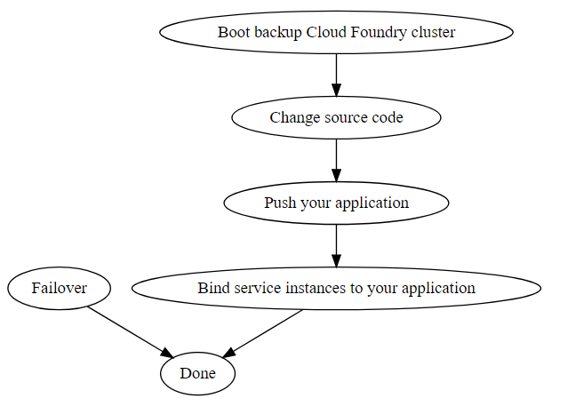

# Disaster Recovery of Cosmos DB

This guidance is suitable for you if you have (at least) two CF clusters. In later guidance, your daily running CF cluster will be called *primary Cloud Foundry cluster(or priamry cluster)* and your CF cluster prepared for disaster recovery will be called *backup Cloud Foundry cluster(or backup cluster)*. The service broker in the primary Cloud Foundry cluster will be called *primary service broker* and the service broker in the backup Cloud Foundry cluster will be called *backup service broker*.

## Prerequisite

- In the manifest of the backup service broker, set `ENABLE_DISASTER_RECOVERY_SERVICES` flag to `true`.
- Make sure that the service principal used by the backup service broker has access to the resource created by the primary service broker. The easiest way is to use the same service principal.

## Steps for setting up disaster recovery

### 1. Create or update a CosmosDB instance

Create a CosmosDB service instance which has at least one read region, or update an existing CosmosDB service instance to have at least one read region. Your data will be synchronized across read regions. 

#### I. Create an instance with at least one read region

Click [here](../modules/cosmosdb.md) for detailed information about provision parameters. Below is an example:

```bash
cf create-service azure-cosmosdb-sql account myCosmosDB -c '{
    "resourceGroup": "demo",
    "location": "eastus",
    "readRegions": ["westus", "southcentralus"],
    "autoFailoverEnabled": "enabled"
}'
```

This example will create a SQL CosmosDB account which has one write region and two read regions with auto failover enabled. Data will be synchronized across these three regions. 

#### II. Update an existing instance to have at least one read region

Suppose you already have a CosmosDB service instance and you have written some data to it. In this case, you can update it to have at least one read region. The data in existing region will be copied to read regions automatically. Click [here](../modules/cosmosdb.md) for detailed information about update parameters. Below is an example:

```bash
cf update-service myCosmosDB -c '{
    "readRegions": ["eastasia"],
    "autoFailoverEnabled": "enabled"
}'
```

This example will update existing  `myCosmosDB` instance to have one read region with auto failover enabled.

### 2. Create *-registered service instance in another Cloud Foundry cluster

`-*registered` services are used to register existing Cosmos instances and provide credential of existing Cosmos instances. This kinds of service should be only used for DR. In provision step, it takes resource group name, database account name and possible database name as parameters, finds the database account and gets the credential of the account. In bind step, it will return gotten credentials. In deprovision step, it does nothing. For detailed information of these services, see [here](./modules/cosmosdb.md).

For each service instance in primary Cloud Foundry cluster, you need to create a `*-registered` service instance in the backup Cloud Foundry cluster. So that when a disaster happens in the Azure region where your primary cluster is located, you can continue to use the Cosmos service instance in the backup cluster. 

You can create `*-registered` service instance by script or manually.

#### I. By script

We have provided scripts for you, you can find them [here](../../scripts/cosmosdb-disaster-recovery). It's convenient to use scripts if you have many service instances in the primary Cloud Foundry cluster. Follow below steps:

1. Make sure you have installed [redis-cli](https://redis.io/download) and [jq](https://stedolan.github.io/jq/download/) in the operating environment. 

2. Make sure you have bound service instances which need to be exported to an app. Only bound service instances can be detected by the script. Use `cf bind-service <APP_NAME> <SERVICE_INSTANCE_NAME>` to bind service instances and run `cf services` to check bind status of services instances. 

3. Run following command in shell with primary Cloud Foundry cluster logged in: 

   ```bash
   cd <PATH_TO_SCRIPTS>
   ./export.sh -h <STORAGE_REDIS_HOST> -a <STORAGE_REDIS_PASSWORD> -d <YOUR_SYSTEM_DOMAIN> -o <OUTPUT_FILE_NAME>
   ```

   For example: `./export.sh -h example.redis.cache.windows.net -a password -d example.com -o export.json`. You will get `export.json` containing non-sensitive information like this:

   > [
   >    {
   >       "resourceGroup":"tosiCosmos",
   >       "serviceName":"azure-cosmosdb-mongo-account",
   >       "planName":"account",
   >       "instanceName":"mymongo",
   >       "accountName":"b4292796-995a-4f8a-8599-beba1f0bd295",
   >       "databaseName":""
   >    },
   >    {
   >       "resourceGroup":"tosiCosmosTest3",
   >       "serviceName":"azure-cosmosdb-sql",
   >       "planName":"sql-api",
   >       "instanceName":"cosmossql",
   >       "accountName":"b71e3845-2181-495c-a1c6-d002c028badc",
   >       "databaseName":"3205b45b-604e-44b4-b504-086275cbfe85"
   >    }
   > ]

4. Copy the generated file to the backup cluster's operating environment. Run following command in shell with the backup Cloud Foundry cluster logged in:

   ```bash
   cd <PATH_TO_SCRIPTS>
   ./import.sh <PATH_TO_GENERATED_FILE>
   ```

   The import script will automatically create a corresponding `*-registered` service instance for each instance in the json file. The instance will be named as `<instanceName>-registered`. For example, if you run ` ./import.sh export.json` , two new services instances will be created: 

   | Service instance name | service                                 | plan    |
   | --------------------- | --------------------------------------- | ------- |
   | mymongo-registered    | azure-cosmosdb-mongo-account-registered | account |
   | cosmossql-registered  | azure-cosmosdb-sql-registered           | sql-api |

#### II. Manually

If you only have few service instances in the primary Cloud Foundry cluster, it's ok to manually create corresponding service instance in the backup cluster. Follow below steps:

1. Use `cf bind-service <APP_NAME> <SERVICE_INSTANCE_NAME>`  to bind service instances which need to be exported. For example `cf bind-service demoapp myCosmosDB`.

2. Run `cf env <APP_NAME>` to get the credential of the service instance. For example, `cf env demoapp`, you will get something like this:

   > {
   >  "VCAP_SERVICES": {
   >   "azure-cosmosdb-sql-database": [
   >    {
   >     "binding_name": null,
   >     "credentials": {
   >      "databaseName": "61354ee5-a5db-4afc-ac52-fc3e1057dbc6",
   >      "documentdb_database_id": "61354ee5-a5db-4afc-ac52-fc3e1057dbc6",
   >      "documentdb_host_endpoint": "https://7f5d760c-868b-4ae9-bf0d-9c413a4cccc1.documents.azure.com:443/",
   >      "documentdb_master_key": "<KEY>",
   >      "primaryConnectionString": "<CONNECTION_STRING>",
   >      "primaryKey": "<KEY>",
   >      "uri": "https://7f5d760c-868b-4ae9-bf0d-9c413a4cccc1.documents.azure.com:443/"
   >     },
   >     ...
   > }

   Record the `databaseName` and `accountName`. `accountName` is the string between "https://" and ".documents.azure.com:443/" in`uri` field. In the example, `accountName` is `7f5d760c-868b-4ae9-bf0d-9c413a4cccc1`, and `databaseName` is `61354ee5-a5db-4afc-ac52-fc3e1057dbc6`.

   Also, you should know the resource group of your service instance.

3. Log in the backup Cloud Foundry cluster, create corresponding `*-registered` service instance using following command:

   ```bash
   cf create-service *-registered <PLAN> <INSTANCE_NAME> -c '{"resourceGroup": "<RESOURCE_GROUP_NAME>", "accountName": "<ACCOUNT_NAME>" [, "databaseName": "<DATABASE_NAME>"]}'
   ```

   `databaseName` is only needed for `azure-cosmosdb-sql-database-registered` and `azure-cosmosdb-sql-registered`. 

   In the example, the instance has service `azure-cosmosdb-sql-database`, so in the backup cluster, `azure-cosmosdb-sql-database-registered` should be created. We run:

   ```bash
   cf create-service azure-cosmosdb-sql-database-registered database demo-registered-db -c '{"resourceGroup": "exampleRG", "accountName": "7f5d760c-868b-4ae9-bf0d-9c413a4cccc1", "databaseName": "61354ee5-a5db-4afc-ac52-fc3e1057dbc6"}'
   ```

   For detailed information of `*-registered` services, see [here](./modules/cosmosdb.md).

## Steps for recovering from an outage

### I. Steps for recovering from an outage of CosmosDB database account write region

In this case, your primary Cloud Foundry cluster still works normally and only the database account instance is out of service. Follow below steps to recover from it.


As the picture, step "Change source code" and "Push your application" must be done serially, and "Failover" can be done in parallel with them.

#### 1. Failover

- If you have set `autoFailoverEnabled` to `enabled` in provision or update, skip this step directly.
- If you haven't set `autoFailoverEnabled` to `enabled`, open Azure portal and find the CosmosDB database account of your instance,  follow [this doc](https://docs.microsoft.com/en-us/azure/cosmos-db/regional-failover#ManualFailovers) to do manual failover.

#### 2. Change source code

Based on how your application is implemented, you may need to change the [connection policy](https://docs.microsoft.com/en-us/dotnet/api/microsoft.azure.documents.client.connectionpolicy?view=azure-dotnet) in your source code. But typically you don't need to change your source code. That's because you always use `["writeRegion", "readRegion1", "readRegion2" ...]` as the preferred locations list. When the disaster happens, `"writeRegion"` is not available and the Cosmos SDK will automatically try to connect to `"readRegion1"`. So we the failover finishes, your application will come online.

#### 3. Push your application

- If you haven't changed your source code in step 2, skip this step.
- If you have changed the source code, use `cf push` to re-push your application, your application will be temporarily offline during pushing.

<br>
You may have noticed that if you enable auto failover and the source code doesn't need to be changed, you even don't need to do anything when the write region is out of service!

### II. Steps for recovering from an outage of Azure region



As the picture, step "Boot backup Cloud Foundy Cluster", "Change source code", "Push your application" and "Bind service instances to your application" must be done serially, and "Failover" can be done in parallel with them.

#### 1. Failover

- If you have set `autoFailoverEnabled` to `enabled` in provision or update, skip this step directly.
- If you haven't set `autoFailoverEnabled` to `enabled`, open Azure portal and find the CosmosDB database account of your instance,  follow [this doc](https://docs.microsoft.com/en-us/azure/cosmos-db/regional-failover#ManualFailovers) to do manual failover.

#### 2. Boot backup Cloud Foundry cluster

Boot your backup Cloud Foundry cluster.

#### 3. Change source code

- Because the service name is changed from `*` to  `*-registered`, you may change the way how your application get the credential. For example, from `env.Get(".VCAP_SERVICES.azure-cosmosdb-sql-database.credentials")` to `env.Get(".VCAP_SERVICES.azure-cosmosdb-sql-database-registered.credentials")`. If you can fetch the credential without specifying the name of the key, then you can avoid changing code. 
- Based on how your application is implemented, you may need to change the [connection policy](https://docs.microsoft.com/en-us/dotnet/api/microsoft.azure.documents.client.connectionpolicy?view=azure-dotnet) in your source code. And It's recommended to [change the connection policy](https://docs.microsoft.com/en-us/azure/cosmos-db/regional-failover#ConfigureMultiRegionApplications) in the backup cluster ahead of time. And then you will be resilient in the face of regional failovers. But you can also keep the connection policy unchanged, the reason is the same as [previous one](#2-change-source-code).

#### 4. Push your application

Use `cf push` to push your application in the backup cluster.

#### 5. Bind service instances to your application

Use `cf bind-service <APP_NAME> *-registered` to bind service instance to your application.

<br>
You can run Step 3 to Step 5 ahead of time, so that you only need to boot your backup cluster and waiting for failover finished once the disaster happens.