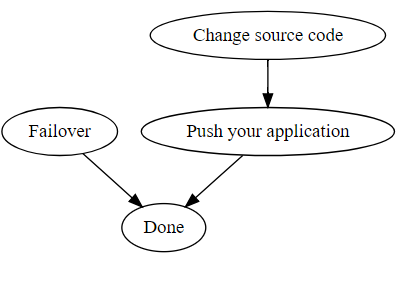

# Disaster Recovery of Cosmos DB

This guidance is suitable for you if you have one running environment. In the guidance, Cloud Foundry will be used as an example.

## Steps for setting up disaster recovery

### 1. Create or update a CosmosDB instance

Create a CosmosDB service instance which has at least one read region, or update an existing CosmosDB service instance to have at least one read region. Your data will be synchronized across read regions. 

#### I. Create an instance with at least one read region

Click [here](../modules/cosmosdb.md) for detailed information about provision parameters. Below is an example:

```bash
cf create-service azure-cosmosdb-sql account myCosmosDB -c '{
    "resourceGroup": "demo",
    "location": "eastus",
    "readRegions": ["westus", "southcentralus"],
    "autoFailoverEnabled": "enabled"
}'
```

This example will create a SQL CosmosDB account which has one write region and two read regions with auto failover enabled. Data will be synchronized across these three regions. 

#### II. Update an existing instance to have at least one read region

Suppose you already have a CosmosDB service instance and you have written some data to it. In this case, you can update it to have at least one read region. The data in existing region will be copied to read regions automatically. Click [here](../modules/cosmosdb.md) for detailed information about update parameters. Below is an example:

```bash
cf update-service myCosmosDB -c '{
    "readRegions": ["eastasia"],
    "autoFailoverEnabled": "enabled"
}'
```

This example will update existing  `myCosmosDB` instance to have one read region with auto failover enabled.

## Steps for recovering from an outage

### Steps for recovering from an outage of CosmosDB database account write region

In this case, your primary Cloud Foundry cluster still works normally and only the database account instance is out of service. Follow below steps to recover from it.



As the picture, step "Change source code" and "Push your application" must be done serially, and "Failover" can be done in parallel with them.

#### 1. Failover

- If you have set `autoFailoverEnabled` to `enabled` in provision or update, skip this step directly.
- If you haven't set `autoFailoverEnabled` to `enabled`, open Azure portal and find the CosmosDB database account of your instance,  follow [this doc](https://docs.microsoft.com/en-us/azure/cosmos-db/regional-failover#ManualFailovers) to do manual failover.

#### 2. Change source code

Based on how your application is implemented, you may need to change the [connection policy](https://docs.microsoft.com/en-us/dotnet/api/microsoft.azure.documents.client.connectionpolicy?view=azure-dotnet) in your source code. But typically you don't need to change your source code. That's because you always use `["writeRegion", "readRegion1", "readRegion2" ...]` as the preferred locations list. When the disaster happens, `"writeRegion"` is not available and the Cosmos SDK will automatically try to connect to `"readRegion1"`. So when the failover finishes, the SDK can connect to it and your application will come online.

#### 3. Push your application

- If you haven't changed your source code in step 2, skip this step.
- If you have changed the source code, use `cf push` to re-push your application.

<br>
You may have noticed that if you enable auto failover and the source code doesn't need to be changed, the only thing you need to do is waiting for the failover finish. You can use Azure portal to monitor the progress of failover.